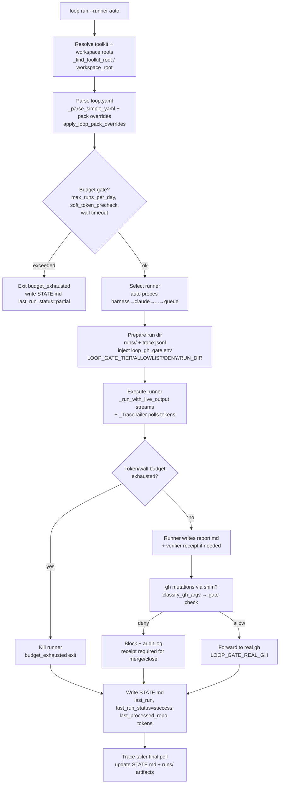

# Loop Runner Design Note

**Status:** Informational  
**Date:** 2026-08-06  
**Owner:** Wave 3 #267 (parent #263)  
**Do not refactor `loop/runner.py` in this issue — documentation first**

User-facing loop behavior lives in `docs/LOOPS.md`. This note covers **internals** of the loop engine so contributors can reason about safety and budgets without reading the full 2.4k LOC.

## Summary

`loop/runner.py` is the tribal harness that turns `loops/<name>/loop.yaml` into a durable run with:
- multi-runner dispatch (Claude / Cursor / Codex / Copilot / OpenCode / harness / queue skeleton)
- three-tier gates (L1 observe-only, L2 assisted, L3 merge/close)
- GitHub mutation gate (`loop-gh-gate` shim)
- token + wall-clock budgets plus `max_runs_per_day`
- resumable checkpointing via `STATE.md`
- per-run artifacts (`runs/<run_id>/` with `trace.jsonl`, `report.md`, receipts)

## Engines (runners)

Runner selection is in `RUNNER_NAMES` / `RUNNER_ALIASES` (`runner.py`):

| Runner | Binary / entry | Env / auth | When selected |
|--------|----------------|------------|---------------|
| `auto` | — | `AGENT_TOOLKIT_LOOP_RUNNER` default | Tries in order `harness → claude → opencode → cursor → copilot → codex → queue` until available |
| `harness` | `dots-ai-devcompanion` `HARNESS_RUNNER_DIR` | `HARNESS_DC_HOME` | Workspace harness queue |
| `claude` | `claude --print` | `CLAUDE_API_KEY` / `ANTHROPIC_API_KEY` | Muse CLI |
| `opencode` | `opencode run` | OpenCode config | OpenCode CLI |
| `cursor` | `cursor-agent` / `agent` / `cursor --print` | `CURSOR_API_KEY` | Cursor Agent CLI |
| `copilot` | `copilot -p` | `COPILOT_GITHUB_TOKEN` / `GH_TOKEN` | GitHub Copilot CLI |
| `codex` | `codex exec` | `OPENAI_API_KEY` / `CODEX_API_KEY` | OpenAI Codex CLI |
| `queue` | `agent-toolkit devcompanion` async queue | — | Skeleton / queued execution |
| `skeleton` | no LLM — writes `plan.md` only | — | Dry-run / offline |

Dispatch lives in `runner.py:_run_with_live_output` and per-runner `run_*` helpers. `--runner` flag or `AGENT_TOOLKIT_LOOP_RUNNER` pins the runner; otherwise `auto` probes availability (`is_available()` per provider). Pack YAML can also override cadence/budget/tier via `loop/pack.py:apply_loop_pack_overrides`.

Key symbols:
- `RUNNER_NAMES`, `RUNNER_ALIASES`, `RUNNER_AUTO` (`loop/runner.py`)
- `LLMDispatcher` (`runner/dispatcher.py`) — policy-filtered provider selection
- `loop/pack.py` — `resolve_pack_path`, `load_pack`, `apply_loop_pack_overrides`

## Tier gates

Tiers are declared in `loop.yaml` `tier: L1|L2|L3` and enforced in two places: the runner's allowlist prompt + the `loop-gh-gate` shim (must not be bypassed).

- **L1 — Observe/report only:** no mutations allowed. `loop-gh-gate` denies all `MUTATING_ACTIONS` at L1 (`gh_gate.py:298`).
- **L2 — Controlled mutations:** allowlisted actions like `comment`, `label`, `assign` are permitted, but `merge`/`close`/`approve`/`push` are denied unless a verifier receipt exists — and at L2 `merge`/`close` are still denied without receipt (`gh_gate.py:298` + `RECEIPT_REQUIRED`).
- **L3 — High-autonomy:** `merge`/`close` allowed only when in `allowlist` **and** a fresh verifier receipt is present in the active `LOOP_GATE_RUN_DIR` (HMAC optionally checked via `LOOP_GATE_RECEIPT_SECRET`). Built for `oss-pr-monitor` Dependabot auto-merge.

The gate is a `gh` shim: `LOOP_GATE_REAL_GH` points to the real `gh`; `LOOP_GATE_TIER`/`ALLOWLIST`/`DENY`/`RUN_DIR` are injected by `runner.py` via `loop_gh_gate_env()`. Classify via `gh_gate.py:classify_gh_argv` (unknown mutating forms fail closed as `push`). Redaction via `redact_argv`.

Key symbols:
- `loop/gh_gate.py` — `MUTATING_ACTIONS`, `RECEIPT_REQUIRED`, `classify_gh_argv`, `gate_config_from_env`, `redact_argv`
- `loop/runner.py` — `loop_gh_gate_env()`, tier checks near lines 624–660, 732–740, 1640+

## State format

- **Loop definition:** `loops/<name>/loop.yaml` (`name`, `tier`, `cadence`, `goal`, `allowlist`, `deny`, `exit_conditions`, `budget`, `request`)
- **Checkpoint:** `loops/<name>/STATE.md` — YAML frontmatter + body, read by `parse_state_md` / written by `write_state_md` (`runner.py:475–495`). Fields: `last_run`, `last_run_status` (`success` / `partial (budget_exhausted)`), `last_processed_repo`, `last_run_tokens`, `last_run_cost`. Resumable loops (`resumable: true`) skip repos before `last_processed_repo`.
- **Per-run artifacts:** `loops/<name>/runs/<run_id>/` with `trace.jsonl` (JSON lines `kind` events: `run_start`, `repo`, `token_usage`, `progress`, `run_end`), `report.md` (LLM output), `receipt.json` (verifier HMAC for merge/close), `prompt.md`.
- **Parser:** `_parse_simple_yaml` fallback when `pyyaml` absent; handles `budget:` block specially.

## Budget enforcement

Defined in `loop.yaml:budget`:

```yaml
budget:
  max_tokens: 50000        # per-run token ceiling
  max_runs_per_day: 1      # frequency gate
  max_wall_seconds: 600    # per-run wall clock
```

Enforcement (see `loop/budget.py` + `runner.py`):

- `wall_timeout_seconds` — per-run timeout, **never** bypassed by `--force` (default 900s, floor 30s)
- `max_tokens_limit` + `_TraceTailer` — poll `trace.jsonl` during `_run_with_live_output`; when `tokens_used >= max_tokens` set `budget_exhausted=True`, kill runner, write `budget_exhausted` exit
- `max_runs_per_day` — count runs under `loops/<name>/runs/` for today; `--force` bypasses only this check, not token/wall budgets
- `soft_token_precheck` — warns when last run's tokens suggest immediate exhaustion
- `_handle_sig` — SIGINT/SIGTERM marks `_CANCELLED`, second signal exits hard

Funds are per-run; resumable loops continue from `last_processed_repo` on the next cadence tick rather than restarting.

## GH mutation gate (loop-gh-gate)

`loop/loop-gh-gate` / `loop/gh_gate.py` is the autonomy boundary:

- Installed as a PATH shim for `gh`; all `gh pr|issue|api|repo` mutations are intercepted and classified.
- Checks order: **deny-list absolute** → tier check → **allowlist** (must be present for L2/L3) → **receipt** for `merge`/`close` (freshness `RECEIPT_MAX_AGE_SEC=3600`, optional HMAC via `LOOP_GATE_RECEIPT_SECRET`) → redacted audit log.
- `--classify` and `--check-receipt` subcommands allow dry-run inspection.
- Env: `LOOP_GATE_REAL_GH`, `LOOP_GATE_RUN_DIR`, `LOOP_GATE_TIER`, `LOOP_GATE_ALLOWLIST`, `LOOP_GATE_DENY`, `LOOP_GATE_VERIFIER`, `LOOP_GATE_RECEIPT_SECRET`, `LOOP_GATE_DISABLED` (tests only).

## Flow: `loop run`



## Pointers to key symbols/files

- `packages/agent-toolkit-cli/src/agent_toolkit/loop/runner.py` — `loops_dir`, `parse_loop_md`, `_parse_simple_yaml`, `parse_state_md`, `write_state_md`, `loop_gh_gate_env`, `_run_with_live_output`, `_TraceTailer`, `_handle_sig`, `workspace_root`, `utc_now`, `run_id`
- `packages/agent-toolkit-cli/src/agent_toolkit/loop/budget.py` — `wall_timeout_seconds`, `max_tokens_limit`, `tokens_from_trace`, `tokens_today`, `token_budget_exceeded`, `soft_token_precheck`
- `packages/agent-toolkit-cli/src/agent_toolkit/loop/gh_gate.py` / `loop/loop-gh-gate` — `classify_gh_argv`, `gate_config_from_env`, `RECEIPT_REQUIRED`, `MUTATING_ACTIONS`, `redact_argv`, `RECEIPT_MAX_AGE_SEC`
- `packages/agent-toolkit-cli/src/agent_toolkit/loop/pack.py` — `resolve_pack_path`, `load_pack`, `apply_loop_pack_overrides`
- `packages/agent-toolkit-cli/src/agent_toolkit/runner/dispatcher.py` — `LLMDispatcher` (policy-filtered LLM selection)
- Schemas: `schemas/loop.schema.json` (validated in CI)
- Templates: `loops/<name>/loop.yaml` (10 bundled templates), `loops/<name>/STATE.md`, `loops/<name>/runs/<run_id>/trace.jsonl`

## Intentional non-goals

- **No live-LLM E2E in CI:** runners are never invoked in CI; only `--skeleton` / parsing / budget / gh-gate unit tests run. Live LLM runs require local auth and are manual.
- **No replacement of `runner.py` custom YAML parser** in this note (follow-up Help Wanted is welcome; see `LOOPS.md`).
- **No change to `loop.yaml` schema** or tier semantics — documentation only.
- **No harness extraction** — RFC for extracting the harness remains Wave 5 (#279).

## References

- User docs: `docs/LOOPS.md`, `docs/HOW_TO_CREATE_LOOP.md`, `schemas/loop.schema.json`
- ADR context: `docs/CONCEPTS.md` (packs vs loops), `docs/adrs/ADR-001` (IR)
- Related: #267 (this note), #263 (CMP Wave 3 epic)
