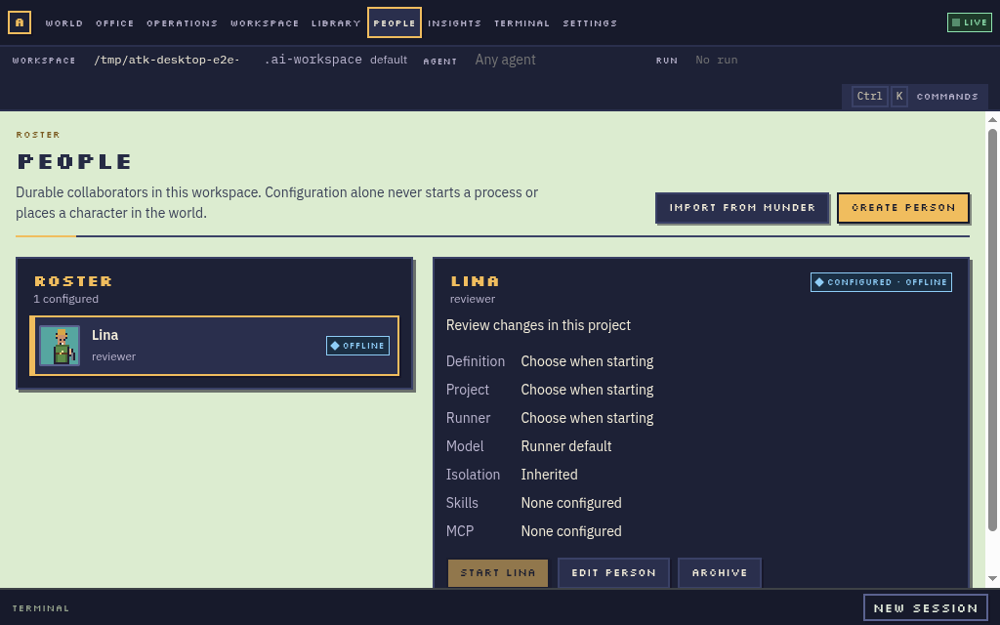
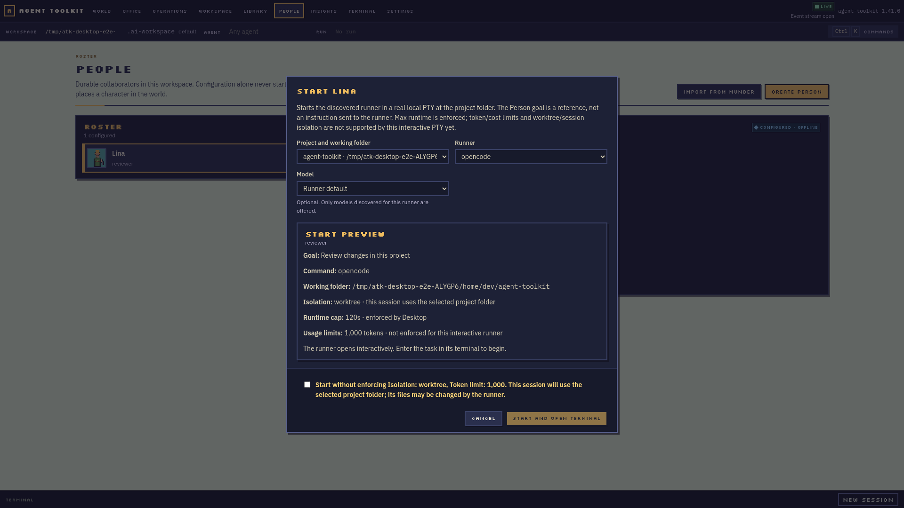
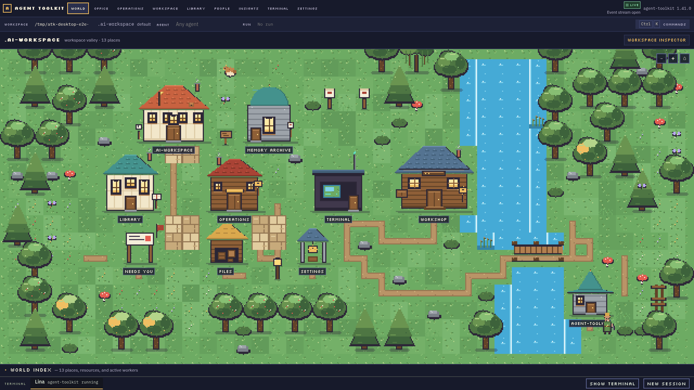
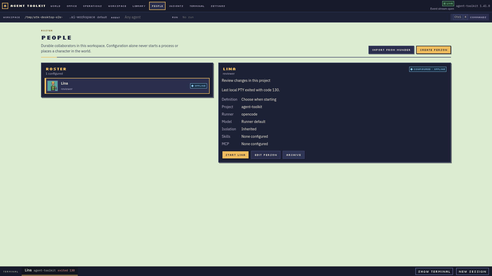

# People — durable collaborators, not running sessions

Status: **PARTIAL PRODUCT DELIVERY** — Desktop supports roster CRUD, reviewed
one-way Munder import, and starting a discovered runner as a real local PTY
bound to a Person and project. The V backend records session identity and
lifecycle history; Electron remains the process/PTY owner. A configured Person
stays offline unless a matching local PTY is alive. The local PTY enforces
`max_seconds`; token and cost limits and non-inherited isolation are disclosed
as unsupported and need explicit acknowledgement. Provider conversation IDs,
resume, and process continuity across app exit are not implemented; see
[Gaps](#gaps).

The screenshots below were captured from the live Electron app and backend at
both compact and large sizes. A configured Person is offline until a real PTY
starts. The world shows the selected Person only while that PTY is alive and
assigned to a registered project.

| Roster at 1024×640 | Start review at 1920×1080 |
|---|---|
|  |  |

| Real Person session in the world | Person after the PTY stops |
|---|---|
|  |  |

A Person is a collaborator you have chosen and reviewed. It persists in your
workspace, not in the toolkit. Configuration alone never creates a character:
a `people/<id>.json` file is a declaration. The current Desktop slice uses
Electron's real PTY state plus the saved Person/project association to project
presence; it does not infer activity from People declarations or fabricate
output.

## Identity model

These five things are different, and the code keeps them different:

| Concept | Where it lives | What it is |
|---|---|---|
| **Agent definition** | toolkit `agents/<name>/AGENT.md` | A reusable persona template — how an AI works in a session |
| **Agent profile** | toolkit `profiles/<target>/` | A per-target adapter/overlay of toolkit capabilities |
| **Person** | workspace `people/<id>.json` | A durable collaborator you chose and reviewed |
| **Agent session** | workspace `.agent-toolkit/sessions/<id>.json` + Electron PTY | Durable lifecycle record joined to one local runner process; provider conversation state is not captured yet |
| **Swarm role** | recipe | A slot in a swarm run, resolved per run |

Workspace personas (`personas/*.md`) constrain behavior and permissions during
a session; they are not identity. A Person composes an optional
`definition_id` reference plus preferences, but is its own durable thing.

## Storage

```text
<workspace>/
  people/
    README.md              scaffold (workspace init)
    <id>.json              one Person per file, spec agent-toolkit/person@1
    bindings.yaml          optional role preferences, spec agent-toolkit/people-bindings@1
  scripts/
    validate-people.py     mirrored offline validator (canonical: toolkit scripts/workspace/validate-people.py)
  schemas/
    person.schema.json     mirrored (canonical: toolkit schemas/person.schema.json)
    people-bindings.schema.json
    people-contracts.lock.json  SHA256/source lock for the mirrors
  .agent-toolkit/
    sessions/
      <session-id>.json    V-owned PersonSession lifecycle evidence
```

`workspace init` scaffolds `people/README.md` and rejects symlinked
destinations before writing anything. The mirrors are written by
`scripts/sync-people-contracts.py` from the toolkit checkout (atomic
replacement, so unrelated hardlinked inodes survive) and verified against the
lock before the validator parses any schema. A drifted mirror fails validation
with a static message; it never evaluates tampered schemas.

## Schema rules (agent-toolkit/person@1)

- Required: `spec`, `id`, `name`, `role`, `goal`, `archived`.
- Optional: `definition_id`, `avatar`, `preferred_provider`,
  `preferred_model`, `capabilities`, `skills`, `mcp_servers`, `isolation`,
  `budget`, `import_source`.
- `id` is lowercase `[a-z0-9][a-z0-9_-]*` (max 64) and must match the filename.
- Reference arrays are bounded at 32 unique entries.
- No runtime fields, no secrets, no commands, no environment, no grants.
- Source flags (`import_source.*`) are inert provenance, never instructions.
- Budget omission means inherited or unknown, never unlimited.
- `additionalProperties: false` everywhere.

## Imports (munder-difflin/hire@1)

`capabilities/imports/munder-hire-v1.json` defines the one-way mapping:
`review_required: true`, `auto_spawn: false`, `auto_install: false`,
`live_sync: false`. It maps name/role/goal/provider/model/skills/MCP fields;
the `definition_id` is chosen during human review. The Desktop importer shows
ignored fields before an explicit save; it never executes or persists embedded
commands. Original character/accent are retained as inert attribution, not
external art. Never treat `hive/registry.json` as runtime authority; there is
no live synchronization.

## Validation

```bash
python3 scripts/validate-people.py --workspace <workspace>
```

Offline only: the validator uses a no-network jsonschema registry, rejects
symlinked directories/files, enforces the 64 KiB declaration limit, the
id/filename match, finite numbers (rejecting `NaN`/`Infinity`/`1e9999`),
duplicate keys, and prints a static diagnostic that never echoes values, keys,
or control bytes. Templates under `templates/people/` are validated but never
counted as configured people.

## Swarm role binding

When a swarm recipe names a role:

Desktop lets the user assign one active Person to each canonical recipe role
before starting. The live backend preview resolves each role in the same way
the run will: an explicit selection wins, then one unused active Person whose
saved `role` or `definition_id` matches the recipe slot, then an ephemeral
recipe role. The review names each selected or matched Person and shows the
ephemeral fallbacks before Start. Roles remain ephemeral responsibilities; the
Person ID is stored with the run and exported as `AGENT_TOOLKIT_PERSON_ID` to
that role's adapter process, including roles started after handoff. This is
currently run metadata and an environment hint: Agent Toolkit does not yet
consume it to associate the process with a canonical `AgentSession`, terminal
action, or World character. The backend rejects unknown roles, missing or
archived People, and duplicate assignments.

The `launch_sessions` API option starts real Herdr/tmux role processes without
attaching the server request to an interactive terminal. Headless mode records
run state only and rejects a request to launch sessions. Runner and model are
still selected for the swarm as a whole; saved per-Person runner/model
preferences are not applied by this runtime. Runtime presence is not projected
into the World from swarm bindings yet.

In the Start Swarm review, **Remember** stores the selected Person as a
workspace default for that recipe role. The UI shows the pinned Person and any
ordered fallback People returned by the backend. Clearing the pin preserves
the fallback list and returns resolution to those fallbacks, compatible role
matching, then an ephemeral role. These controls use the typed
`GET/PUT /api/v1/people/bindings` endpoints; no YAML editing is required.

## Desktop implementation

The People destination lists configured and archived collaborators, and lets
the user create, edit, archive and restore them. The V server validates writes
against the durable declaration shape, stores `people/<id>.json` atomically,
and rejects symlinked storage. The import picker accepts a local
`munder-difflin/hire@1` JSON file, previews every mapped domain field and the
names of ignored fields, and requires a separate save action. Saving or
importing never starts a process. The Start review selects a real project,
discovered runner and optional runner model. The V backend validates the
Person, linked project and provider, resolves the canonical working folder,
and writes `.agent-toolkit/sessions/<id>.json` with `launching` before Electron
opens the runner through node-pty. Electron reports `running` and terminal lifecycle outcomes;
on startup, Desktop reconciles active records against PTYs still owned by its
main process and records missing processes as interrupted. The PTY carries the
V session ID, Person ID and project ID so a living process can be inspected
from the world and reopened in Terminal; stopping/reaping it leaves the Person
untouched. This record is lifecycle evidence, not a provider conversation
transcript or resumable session. The portrait uses original Toolkit sprites;
source appearance is attribution only. Operations also offers explicit Person
assignment per swarm role, validates the choice against the workspace roster,
and can launch real adapter-backed role sessions.

## Gaps

The following are explicitly **not implemented**. Do not represent schemas or
file authoring as the user interface:

- Runner-specific provider session IDs, conversation history, safe resume, and
  keeping a process alive after Desktop exits. The durable lifecycle record
  remains, but Desktop marks a missing PTY as interrupted rather than claiming
  the provider conversation can resume.
- The saved Person goal and definition are shown in the review but are not yet
  sent as a runner prompt. Start opens the provider interactively; the user
  enters the task in its real terminal.
- Runtime enforcement of token/cost limits and non-inherited isolation for the
  local PTY Start flow. `max_seconds` is enforced by Desktop and stops the PTY
  when its time budget expires.
- Per-role runner/model preference enforcement, an Agent Toolkit consumer for
  the swarm Person environment hint, swarm-process terminal reopen/stop from
  Desktop, and truthful swarm-session projection into the World.

Explicit assignment wins. The backend then applies ordered preferences from
`people/bindings.yaml`, followed by automatic matching by saved `role` or
`definition_id`; any unmatched role remains ephemeral. Workspace role defaults
are configured from the reviewed Desktop swarm start flow; the YAML file is an
interoperability format, not the user interface. Per-role runner/model
preferences are not applied yet.
