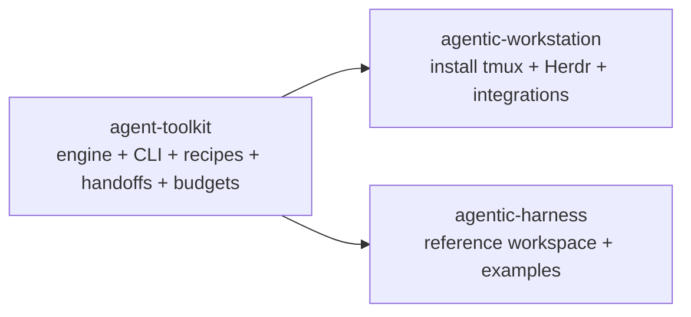
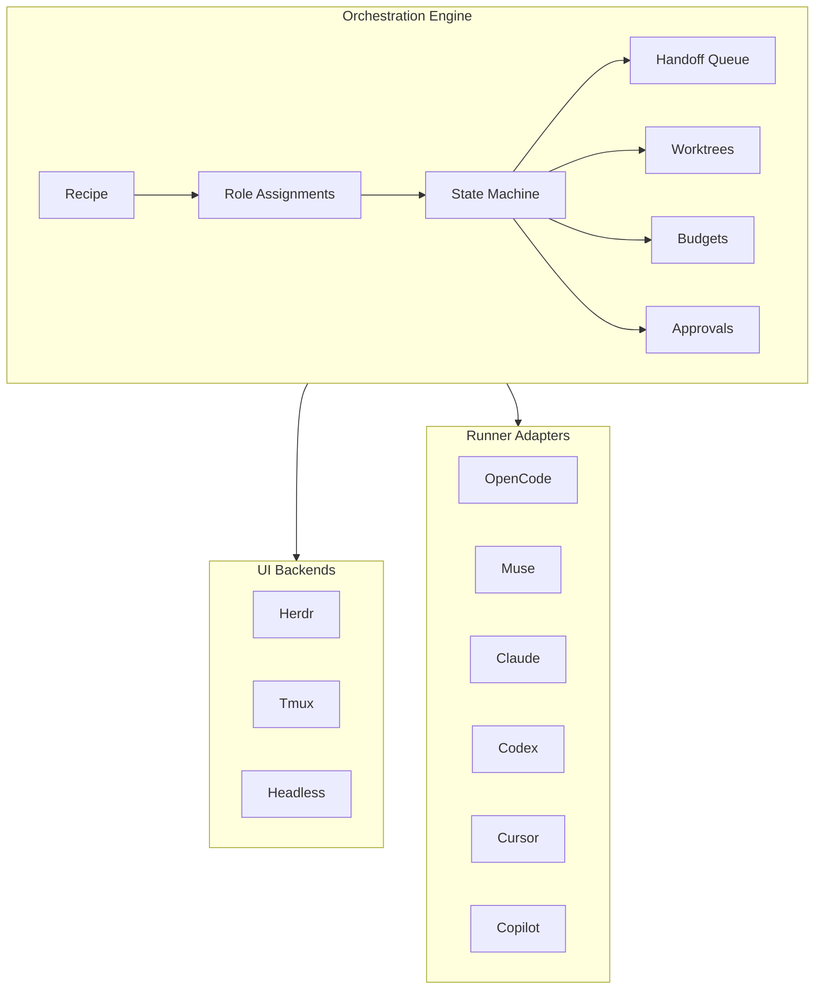
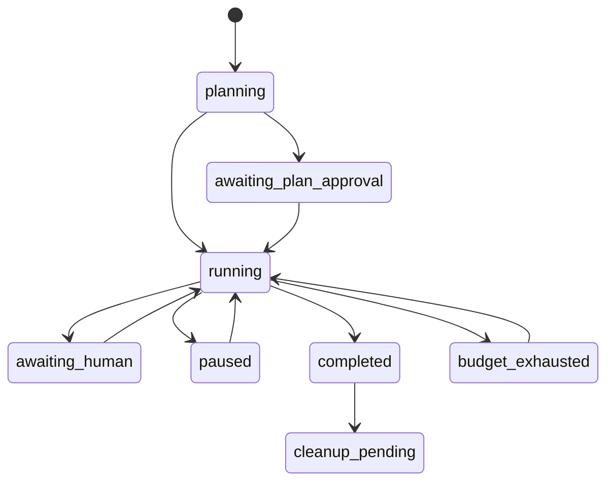
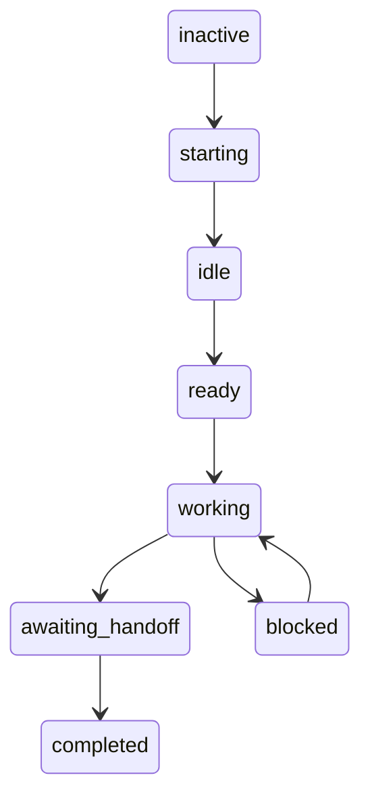
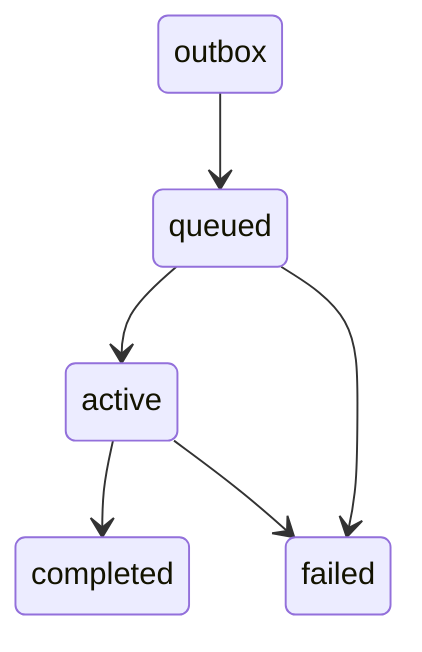
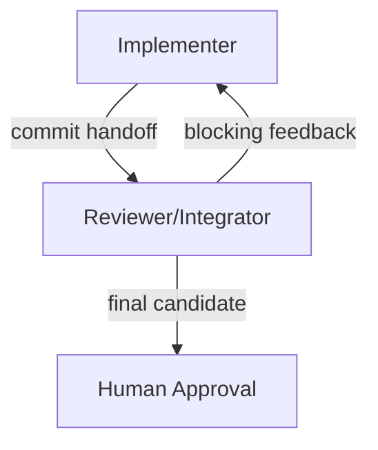
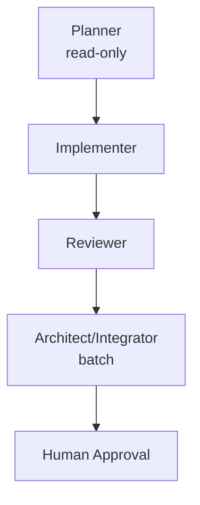
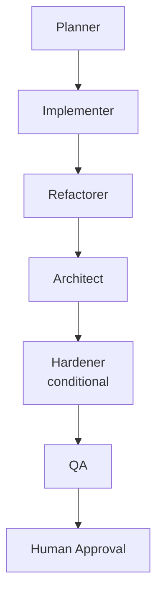
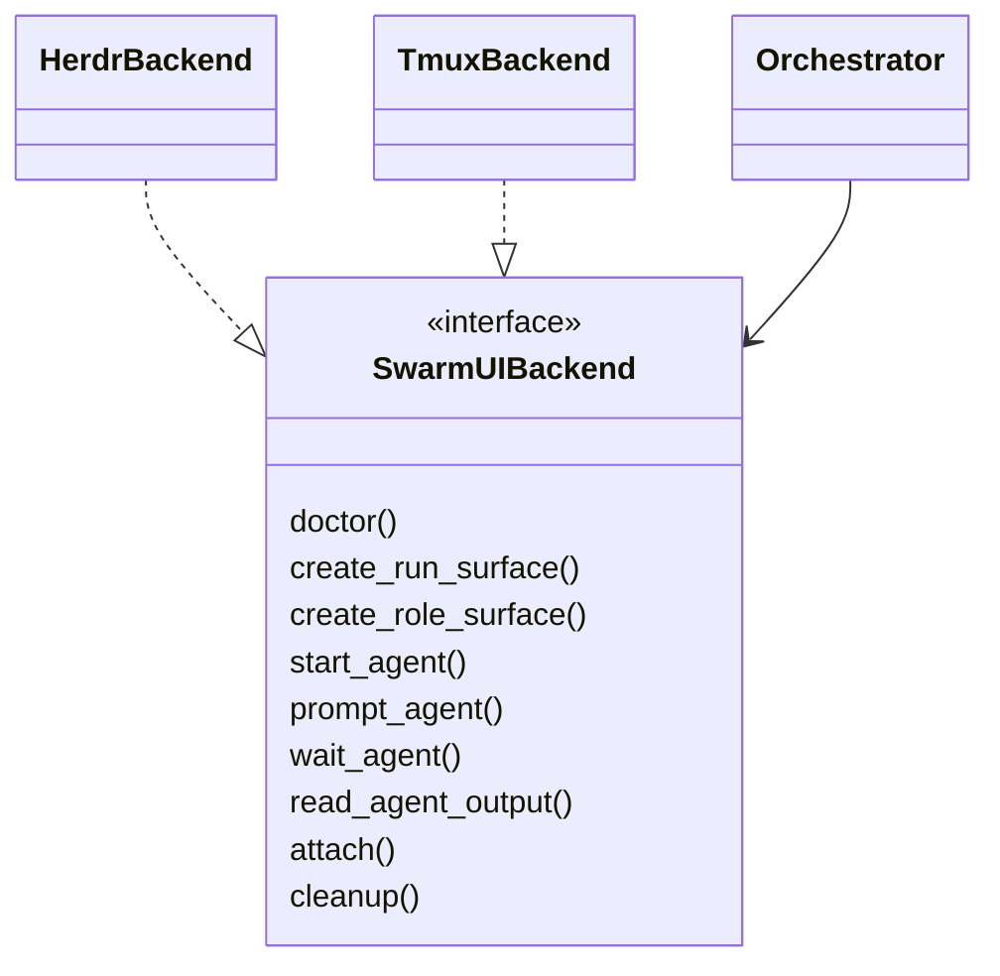

# Swarm Architecture

## Three-Repository Ownership



- **agent-toolkit** owns runtime behavior (recipes, handoffs, state, worktrees, budgets, runners, Herdr/tmux adapters, prompts, artifacts). Sole source of truth.
- **agentic-workstation** installs dependencies, not orchestration.
- **agentic-harness** demonstrates usage, not implementation.

## Runtime Layers



UI and runner are adapters; filesystem state authoritative.

## State Files

```
.agent-toolkit/swarm/runs/<run-id>/
  run.yaml
  state.json          # versioned, atomic
  trace.jsonl         # append-only events
  budget.json
  ownership.json
  approvals.json
  artifacts/
  handoffs/{outbox,queued,active,completed,failed}/
  prompts/
  worktrees/
  runner/opencode/agents/
```

## Run State Machine



## Role State Machine



## Handoff State Machine



Only one active task per task-mode role; batch mode allows multiple.

## Pair Workflow



## Team Workflow



## Full Workflow



## Herdr/Tmux Adapter Separation



No backend conditionals in orchestrator; backend metadata stays in backend state.

## Security Boundaries

- Validate role/branch/commit identifiers; full SHA internally.
- Atomic writes, path containment, symlink escape prevention.
- Deny `external_directory`, `push`, `release`, `base-merge`.
- Redact secrets, never serialize credentials.
- Cleanup only Toolkit-owned worktrees; preserve dirty.

## Cost Controls

Reuse `loop/budget.py` ideas. Limits: total tokens, per-role, cost, wall-clock, concurrency, restarts, round-trips, artifact size, handoff count. On limit: stop launching, preserve resumable `budget_exhausted`, partial report, explain resume.

See ADR-008 for decisions and rejected alternatives.
