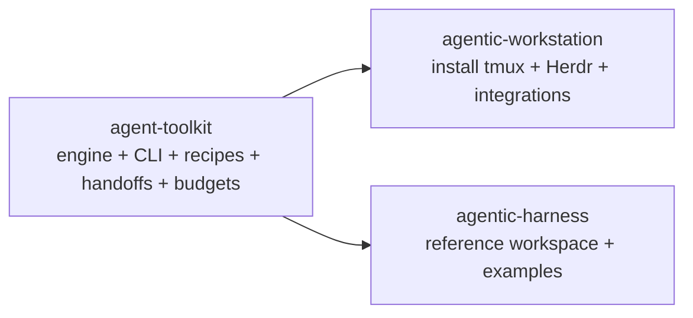
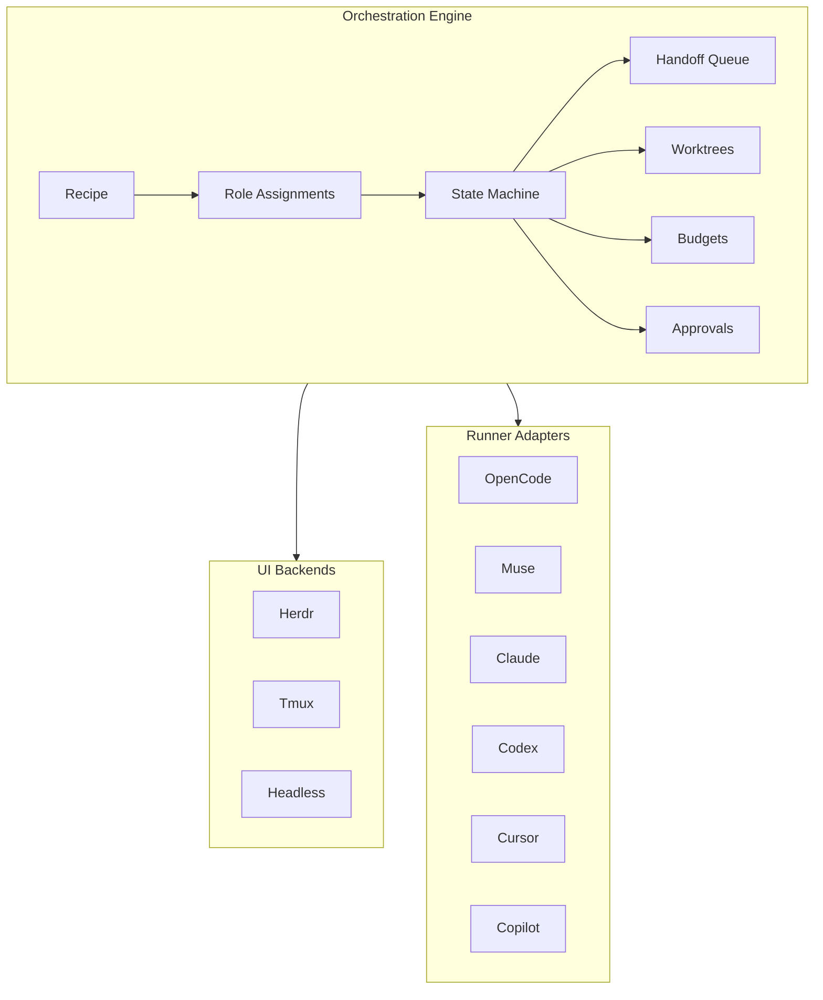
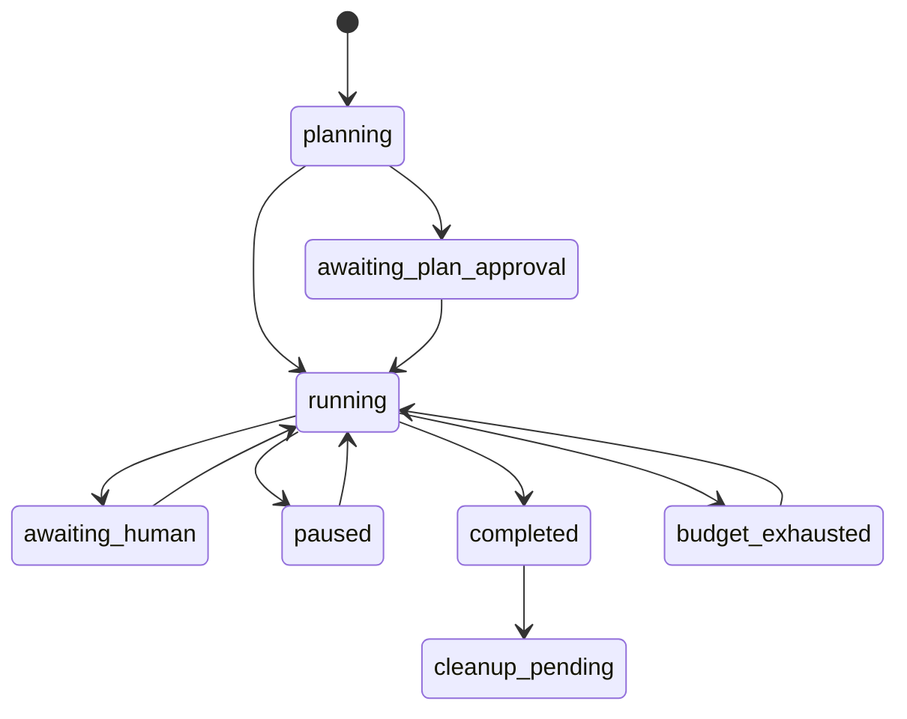
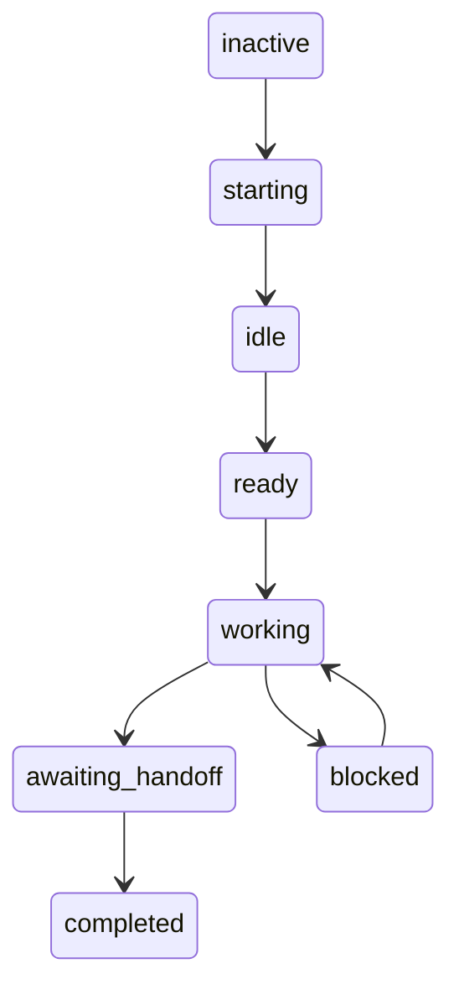
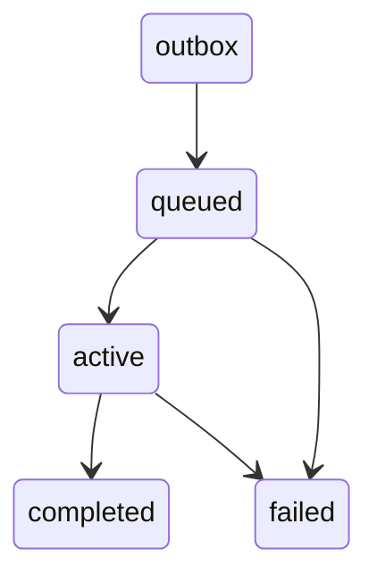
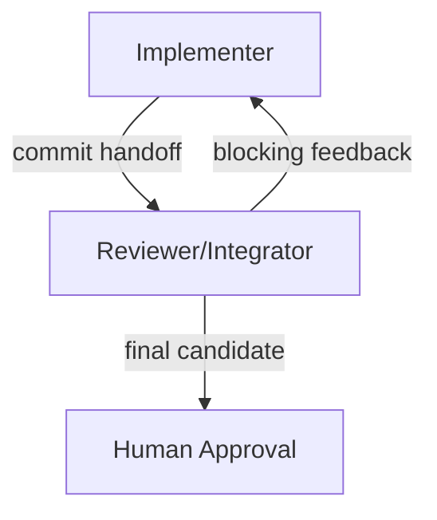
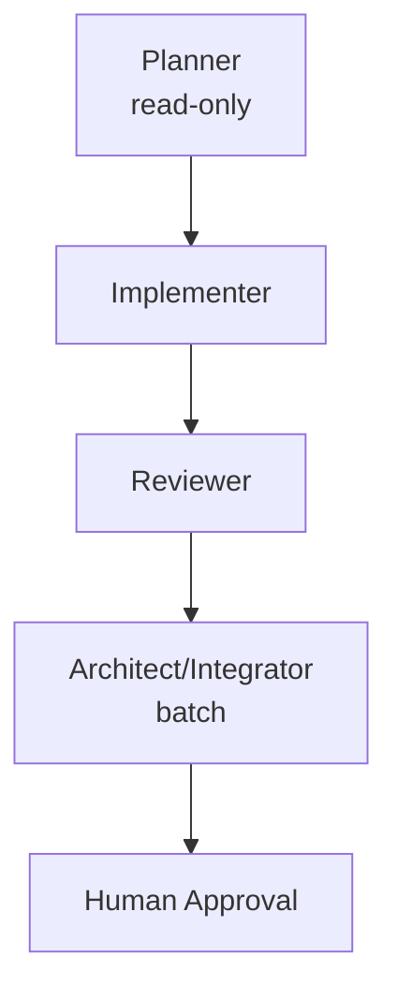
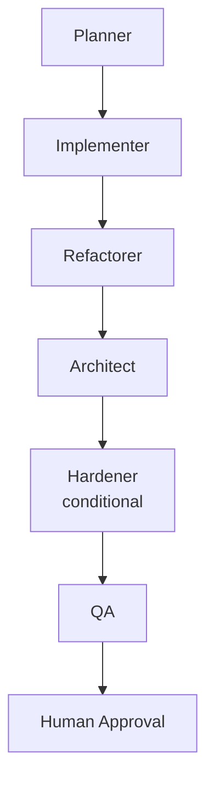
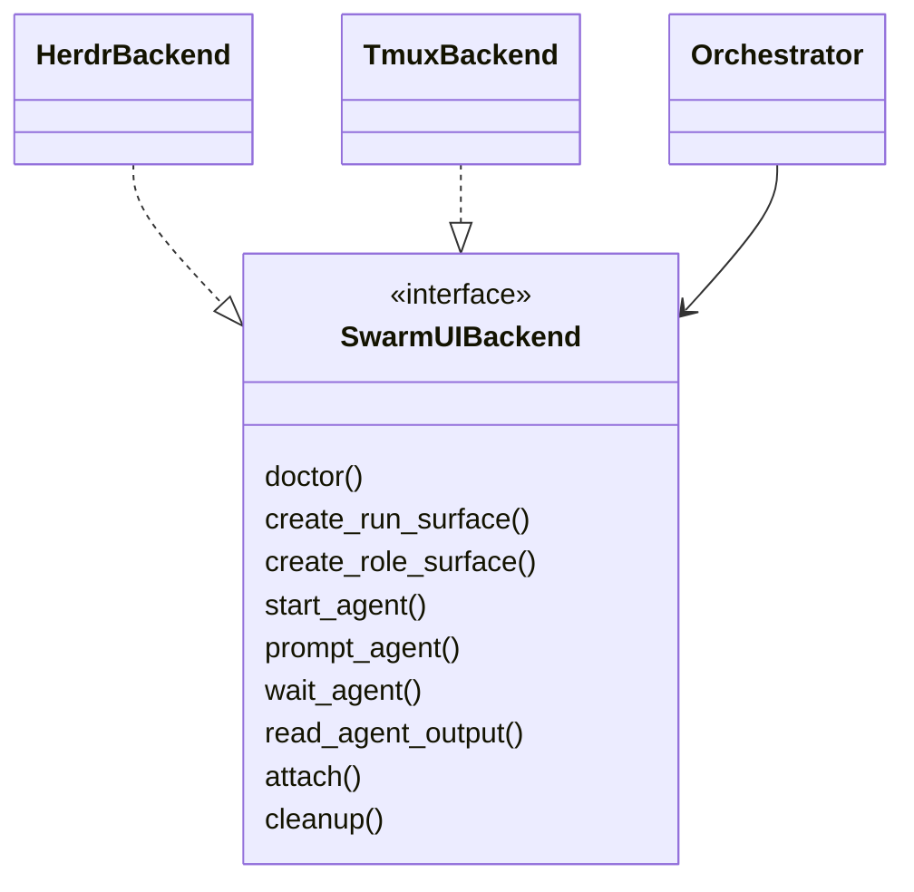

# Swarm Architecture

## Three-Repository Ownership


```mermaid
flowchart LR
  AT[agent-toolkit<br/>engine + CLI + recipes + handoffs + budgets]
  WS[agentic-workstation<br/>install tmux + Herdr + integrations]
  AH[agentic-harness<br/>reference workspace + examples]
  AT --> WS
  AT --> AH
```

- **agent-toolkit** owns runtime behavior (recipes, handoffs, state, worktrees, budgets, runners, Herdr/tmux adapters, prompts, artifacts). Sole source of truth.
- **agentic-workstation** installs dependencies, not orchestration.
- **agentic-harness** demonstrates usage, not implementation.

## Runtime Layers


```mermaid
flowchart TB
  subgraph Orchestration[Orchestration Engine]
    R[Recipe] --> RA[Role Assignments]
    RA --> S[State Machine]
    S --> H[Handoff Queue]
    S --> W[Worktrees]
    S --> B[Budgets]
    S --> A[Approvals]
  end
  subgraph UI[UI Backends]
    Herdr
    Tmux
    Headless
  end
  subgraph Runner[Runner Adapters]
    OpenCode
    Muse
    Claude
    Codex
    Cursor
    Copilot
  end
  Orchestration --> UI
  Orchestration --> Runner
```

UI and runner are adapters; filesystem state authoritative.

## State Files

```
.agent-toolkit/swarm/runs/<run-id>/
  run.yaml
  state.json          # versioned, atomic
  trace.jsonl         # append-only events
  budget.json
  ownership.json
  approvals.json
  artifacts/
  handoffs/{outbox,queued,active,completed,failed}/
  prompts/
  worktrees/
  runner/opencode/agents/
```

## Run State Machine


```mermaid
stateDiagram-v2
  [*] --> planning
  planning --> awaiting_plan_approval
  planning --> running
  awaiting_plan_approval --> running
  running --> awaiting_human
  running --> paused
  running --> completed
  running --> budget_exhausted
  awaiting_human --> running
  paused --> running
  budget_exhausted --> running
  completed --> cleanup_pending
```

## Role State Machine


```mermaid
stateDiagram-v2
  inactive --> starting
  starting --> idle
  idle --> ready
  ready --> working
  working --> awaiting_handoff
  working --> blocked
  blocked --> working
  awaiting_handoff --> completed
```

## Handoff State Machine


```mermaid
stateDiagram-v2
  outbox --> queued
  queued --> active
  active --> completed
  active --> failed
  queued --> failed
```

Only one active task per task-mode role; batch mode allows multiple.

## Pair Workflow


```mermaid
flowchart TB
  I[Implementer] -->|commit handoff| R[Reviewer/Integrator]
  R -->|blocking feedback| I
  R -->|final candidate| H[Human Approval]
```

## Team Workflow


```mermaid
flowchart TB
  P[Planner<br/>read-only] --> I[Implementer]
  I --> R[Reviewer]
  R --> A[Architect/Integrator<br/>batch]
  A --> H[Human Approval]
```

## Full Workflow


```mermaid
flowchart TB
  P[Planner] --> I[Implementer]
  I --> RF[Refactorer]
  RF --> A[Architect]
  A --> H1[Hardener<br/>conditional]
  H1 --> QA[QA]
  QA --> H[Human Approval]
```

## Herdr/Tmux Adapter Separation


```mermaid
classDiagram
  class SwarmUIBackend {
    <<interface>>
    doctor()
    create_run_surface()
    create_role_surface()
    start_agent()
    prompt_agent()
    wait_agent()
    read_agent_output()
    attach()
    cleanup()
  }
  HerdrBackend ..|> SwarmUIBackend
  TmuxBackend ..|> SwarmUIBackend
  Orchestrator --> SwarmUIBackend
```

No backend conditionals in orchestrator; backend metadata stays in backend state.

## Security Boundaries

- Validate role/branch/commit identifiers; full SHA internally.
- Atomic writes, path containment, symlink escape prevention.
- Recipe declarations describe intended policy; they are not enforced OS-level denies. Runner access depends on provider configuration and local permissions.
- Do not assume credentials or runner output are universally redacted or absent from state.
- Cleanup checks Toolkit worktree ownership and dirty state; `prune` is a separate operation that may remove generated branches and run records.

## Cost Controls

The V runtime declares total-token, cost, wall-clock, concurrency, and
round-trip budget fields. Current hard exhaustion checks cover wall-clock;
token/cost counters are persisted but are not yet populated by runner usage,
and concurrency/round-trip fields are not enforced. Treat those values as
configuration or estimates, not reliable hard limits, until the corresponding
runner and enforcement paths are implemented. See
`modules/agent_toolkit_core/swarm_recipes.v` and `swarm.v`.

See ADR-008 for decisions and rejected alternatives.
