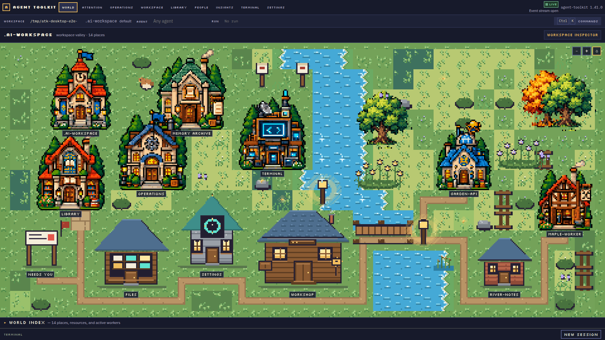
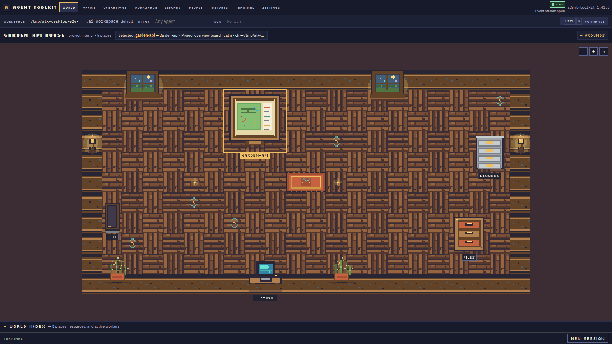
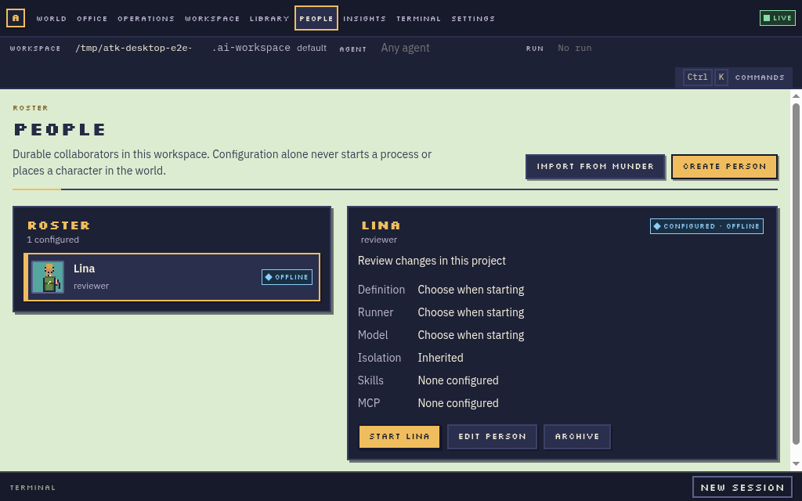
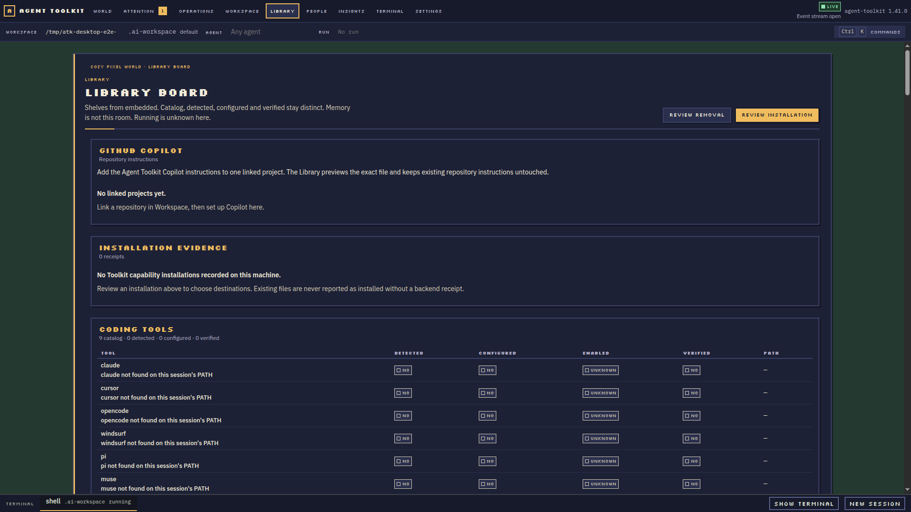
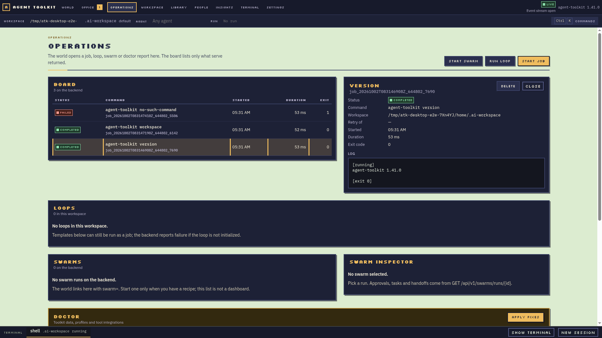

# Agent Toolkit Desktop

Agent Toolkit Desktop is a standalone Electron workstation over the canonical
`agent-toolkit serve` backend. Its home screen is a semantic world: the workspace
is a valley, registered projects are buildings, and shared services have their
own recognizable places. The spatial view explains where things belong; the
inspectors provide precise control without requiring the user to walk an avatar
or run CLI commands.

  

## See the product

These are screenshots captured from the running Electron application with its
real backend. They are product evidence, not concept-board art or SVG mockups.
The larger world and inspector gallery is in the [repository README](../../README.md#desktop-app-gui).

| Project interior | People roster |
| --- | --- |
|  |  |
| Library | Operations |
|  |  |

The current screenshots show real behavior, but do not imply visual sign-off.
The [visual QA log](VISUAL_QA.md) records the exact captures opened, remaining
composition issues, and what changed after review.

## Navigate by place or by action

| Place | What belongs there | Direct route |
| --- | --- | --- |
| World | Workspace context and actual project buildings | `/world` |
| Project house | Files and project-scoped actions for that repository | Enter a project from World or Workspace |
| Library | Reusable skills, Agent Definitions, packs and MCP resources | Library navigation |
| Archive | Workspace memory and durable records | Memory navigation |
| Operations | Jobs, loops, swarms, approvals, artifacts and recovery | Operations navigation |
| Terminal | Real local PTY sessions | Terminal navigation or terminal dock |
| People | Durable collaborator profiles, separate from live sessions | People navigation |
| Attention | Failures and items that need a human response | Attention navigation |

World objects, menus and the command palette converge on the same typed backend
actions. A place should communicate real product state and open a canonical
resource; decoration never stands in for a control. See the [semantic world
contract](SEMANTIC_WORLD.md) and [UX architecture](UX_ARCHITECTURE.md).

## Start using Desktop

Install the platform package from [GitHub Releases](https://github.com/ulises-jeremias/agent-toolkit/releases/latest): AppImage or `.deb` on Linux, DMG on macOS, or NSIS on Windows. The package includes the V backend and its world assets. No CLI installation, repository checkout, or manual configuration-file editing is required for the basic Desktop setup.

The app guides workspace creation or selection, then exposes capabilities,
People, projects, terminals and operations from the interface. A runner must be
installed and available before starting a coding session; unavailable runners
are reported as such. See [packaging](PACKAGING.md) for package contents and
the current clean-install evidence.

## Product model

- **AgentDefinition** is a reusable Toolkit definition.
- **Person** is a durable collaborator configured by the user.
- **AgentSession** is a real live runtime process.
- **SwarmRole** is a temporary responsibility in one swarm run.

An offline Person remains visible in People and is absent from the world. Only a
live session, job or run with real project context can create runtime presence.
The Person remains after the process exits. The [People guide](../PEOPLE.md)
documents supported configuration and current session limits.

## Current status and evidence

The executable coverage source is [`workflows.yaml`](workflows.yaml). It marks
each user journey `ok`, `partial`, `blocked`, or `not-implemented` with evidence;
read it before assuming a workflow is complete. Visual quality is tracked
separately in [VISUAL_QA.md](VISUAL_QA.md). Person sessions now have durable V
lifecycle records and recover truthfully as interrupted when the local PTY is
gone. Important gaps remain: provider conversation IDs and safe resume, sending
the saved Person goal to a runner, enforcing token/cost limits and isolation for
interactive PTYs, full Person preference enforcement in swarms, and remaining
valley/interior composition work. A runner-unavailable Start review is shown in
the [People guide](../PEOPLE.md#desktop-implementation) alongside the successful
runner review and the compact/large roster screenshots.

The table below is a user-facing summary of that ledger. “Partial” means the
GUI path exists but a documented end-to-end capability or recovery case is
still missing; it does not mean the user should substitute a CLI command.

| Workflow | Desktop entry point | Status | Current limit |
| --- | --- | --- | --- |
| Create or switch workspace | Onboarding, Settings, Workspace | Partial | Workspace setup and switching still need stronger end-to-end recovery evidence. |
| Enter a project and open real files | World project house, Workspace | **Ready** | Project-specific files are read from the linked project through the backend. |
| Browse and install capabilities | Library | Partial | Catalog versus installed state needs a mixed-state review; compiled Copilot Skills and Agent Definitions are not yet installable here. |
| Configure MCP | Library → MCP | **Ready** | Probe verifies local executable health; it does not claim a live model connection. |
| Start and inspect jobs | Operations; World presence | **Ready** | Only backend-confirmed active work appears in the World. |
| Use a real terminal | Terminal or terminal dock | **Ready** | PTY lifecycle is real; a Person’s interactive limits are shown before Start. |
| Manage and import People | People | **Ready** | Import is reviewed and inert; saving a Person never starts it. |
| Start a Person | People → Start | Partial | Provider conversation resume, goal injection, token/cost enforcement, and isolated PTYs are not supported. |
| Start and operate swarms | Operations → Swarms | Partial | Role review and controls exist; per-Person runner/model, session identity, World presence, and full adapter recovery remain incomplete. |
| Run or schedule loops | Operations → Loops | **Ready** | Run reports and schedule preview/create/disable are available in the GUI. |
| Find and launch actions | Command palette (`Ctrl/Cmd+K`) | **Ready** | Palette actions route to the same canonical UI/backend operations. |

For exact evidence and the scope of each status, use the journey record in
[`workflows.yaml`](workflows.yaml); this summary deliberately does not upgrade
any ledger result.

For architecture and contribution commands, see the [Desktop package guide](../../apps/desktop/README.md), [design contract](DESIGN.md), and
[contributor guide](../../CONTRIBUTING.md).
